# TravelManager — Architekturübersicht

> Cloud Application Development · HTWG Konstanz · Sommersemester 2026

---

## Inhaltsverzeichnis

1. [Systemüberblick](#1-systemüberblick)
2. [C4 Systemkontext](#2-c4-systemkontext)
3. [Architekturmuster](#3-architekturmuster)
4. [Microservices & Verantwortlichkeiten](#4-microservices--verantwortlichkeiten)
5. [Komponentendiagramm (API-Gateway)](#5-komponentendiagramm-api-gateway)
6. [Datenbankarchitektur](#6-datenbankarchitektur)
7. [Multi-Tenancy-Modell](#7-multi-tenancy-modell)
8. [Asynchrone Ereignisverarbeitung](#8-asynchrone-ereignisverarbeitung)
9. [Anfrage-Lebenszyklus](#9-anfrage-lebenszyklus)
10. [Deployment & Infrastruktur](#10-deployment--infrastruktur)
11. [Authentifizierung & Autorisierung](#11-authentifizierung--autorisierung)
12. [Observability & Metering](#12-observability--metering)
13. [Lokale Entwicklungsumgebung](#13-lokale-entwicklungsumgebung)

---

## 1. Systemüberblick

**TravelManager** ist eine **B2B-SaaS-Plattform** für soziales Reiseplanen. Sie erlaubt Reisenden, Trips zu planen und zu teilen, empfängt automatische Reisewarnungen und -wetterberichte und bietet B2B-Partner-Analytics für Reisezieldestinationen.

| Merkmal | Ausprägung |
|---|---|
| **Architekturstil** | Cloud-native Microservices |
| **Laufzeitumgebung** | Google Kubernetes Engine (GKE Autopilot) |
| **Frontend** | Nuxt 3 SPA (Vue 3) |
| **Backend** | 8 Node.js-Microservices (Nitro/H3) |
| **Primäre Datenbank** | PostgreSQL 16 (Cloud SQL + pgvector) |
| **Messaging** | Google Cloud Pub/Sub |
| **Auth** | Firebase Authentication (JWT) |
| **IaC** | Terraform + Helm |

### Preispläne

| Plan | Kosten | Features | Datenbank |
|---|---|---|---|
| **Free** | $0 | Trip-Planung, Community | Shared (multitenant) |
| **Standard** | €29,99 Onboarding + nutzungsbasiert | + Feed, Newsletter, White-Label | Dedizierter Postgres-Pod |
| **Enterprise** | Individuell | + B2B-Daten, Premium-Support | Dedizierter Postgres-Pod |

---

## 2. C4 Systemkontext

### Ebene 1 — Systemkontext

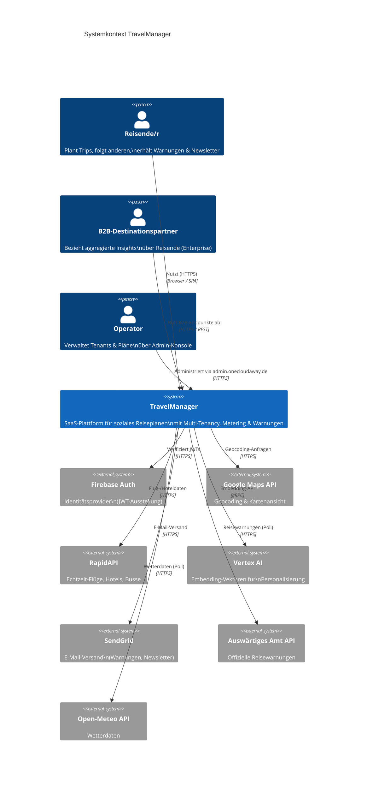

### Ebene 2 — Container

```mermaid
C4Container
    title Container-Diagramm TravelManager

    Person(user, "Nutzer/in", "Browser")

    Container_Boundary(k8s, "Google Kubernetes Engine (GKE Autopilot)") {
        Container(nginx, "Nginx Ingress", "nginx", "TLS-Terminierung, Host-Routing,\nstatische Assets")
        Container(frontend, "Frontend", "Nuxt 3 / Vue 3", "SPA: Trip-Planung, Social-Feed,\nAdmin-Konsole, B2B-Dashboard")
        Container(gateway, "API-Gateway", "Node.js / Nitro", "JWT-Verifikation, Rate-Limiting,\nFeature-Gating, Routing")
        Container(user_svc, "User-Service", "Node.js / Nitro", "Profile, Tenants, White-Label,\nPlan-Abonnements")
        Container(trip_svc, "Trip-Service", "Node.js / Nitro", "Trip-CRUD, Locations, Pläne,\nBewertungen, Likes, Embeddings")
        Container(dest_svc, "Destination-Service", "Node.js / Nitro", "Destinationskatalog, B2B-Analytics")
        Container(social_svc, "Social-Service", "Node.js / Nitro", "Follow-Graph, Feed-Aufbau,\nNewsletter-Generierung")
        Container(travelinfo_svc, "Travel-Info-Service", "Node.js / Nitro", "Reisewarnungen, Wetter,\nAlert-Matching (Polling-CronJob)")
        Container(notify_svc, "Notification-Service", "Node.js / Nitro", "E-Mail-Versand via SendGrid")
        Container(metering_svc, "Metering-Service", "Node.js / Nitro", "Nutzungsaufzeichnung,\nRechnungsstellung")
        Container(provisioner, "Provisioner-Service", "Node.js / Nitro", "Tenant-Provisionierung\n(K8s-StatefulSets)")

        ContainerDb(pg_shared, "Shared PostgreSQL", "PostgreSQL 16 + pgvector", "Shared Datenbanken für\nFree-Tier-Tenants")
        ContainerDb(pg_tenant, "Tenant-PostgreSQL", "PostgreSQL 16 (pro Tenant)", "Dedizierter Pod pro Standard/\nEnterprise-Tenant")
        ContainerDb(redis, "Redis", "Redis 7", "Caching, Rate-Limiting,\nUsage-Aggregation")
        ContainerDb(firestore, "Firestore", "Google Firestore", "Review-Kommentare\n(dokumentenbasiert)")
        Container(pubsub, "Pub/Sub", "Google Cloud Pub/Sub", "Async-Event-Backbone:\nTrips, Alerts, Newsletter, Usage")
    }

    Rel(user, nginx, "HTTPS", "443")
    Rel(nginx, frontend, "HTTP", "3000")
    Rel(nginx, gateway, "HTTP /api/*", "4000")
    Rel(frontend, gateway, "REST/JSON", "via Nginx")
    Rel(gateway, user_svc, "HTTP", "intern")
    Rel(gateway, trip_svc, "HTTP", "intern")
    Rel(gateway, dest_svc, "HTTP", "intern")
    Rel(gateway, social_svc, "HTTP", "intern")
    Rel(gateway, travelinfo_svc, "HTTP", "intern")
    Rel(gateway, metering_svc, "HTTP", "intern")
    Rel(trip_svc, pubsub, "Publish", "TripCreated/Updated")
    Rel(social_svc, pubsub, "Subscribe/Publish", "Feed/Newsletter")
    Rel(travelinfo_svc, pubsub, "Publish", "TravelAlert")
    Rel(notify_svc, pubsub, "Subscribe", "Alerts/Newsletter")
    Rel(metering_svc, pubsub, "Subscribe", "UsageRecorded")
    Rel(user_svc, pg_shared, "SQL", "travelmanager_user")
    Rel(trip_svc, pg_shared, "SQL", "travelmanager_trip")
    Rel(trip_svc, pg_tenant, "SQL", "per-tenant (Standard+)")
    Rel(trip_svc, firestore, "NoSQL", "Kommentare")
    Rel(gateway, redis, "Cache / Rate-Limit", "")
    Rel(user_svc, provisioner, "HTTP", "Provisionierung triggern")
```

---

## 3. Architekturmuster

### Überblick

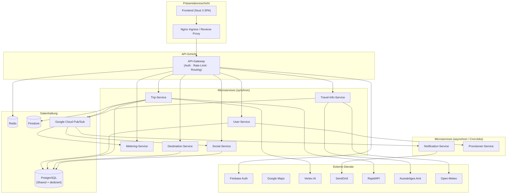

### 12-Factor-Compliance

```mermaid
graph LR
    subgraph "12 Factor App"
        F1["I · Codebase\nMonorepo / npm-Workspaces"]
        F2["II · Dependencies\nper-Service package.json"]
        F3["III · Config\nEnv-Vars (DATABASE_URL etc.)"]
        F4["IV · Backing Services\nCloud SQL, Pub/Sub, Redis"]
        F5["V · Build/Release/Run\nCI → Artifact Registry → Helm"]
        F6["VI · Processes\nStateless Services"]
        F7["VII · Port Binding\nNITRO_PORT=8080"]
        F8["VIII · Concurrency\nDeployments + HPA"]
        F9["IX · Disposability\nFast Boot, Graceful Shutdown"]
        F10["X · Dev/Prod Parity\ndocker-compose.dev.yml"]
        F11["XI · Logs\nStdout → Cloud Logging"]
        F12["XII · Admin Procs\nCronJobs (Warnungen, Newsletter)"]
    end
```

---

## 4. Microservices & Verantwortlichkeiten

```mermaid
graph TD
    subgraph GW_BOX["API-Gateway  (Port 4000)"]
        GW_AUTH["JWT-Verifikation\n(Firebase Admin)"]
        GW_RATE["Rate-Limiting\n(Redis Token-Bucket)"]
        GW_ROUTE["Service-Routing\n+ Feature-Gating"]
        GW_METER["Metering\n(UsageRecorded Events)"]
        GW_AUTH --> GW_RATE --> GW_ROUTE
        GW_ROUTE --> GW_METER
    end

    subgraph US_BOX["User-Service  (Port 8081)"]
        US1["Profile-Management"]
        US2["Tenant-Verwaltung"]
        US3["White-Label-Config"]
        US4["Plan-Abonnements"]
    end

    subgraph TS_BOX["Trip-Service  (Port 8082)"]
        TS1["Trip-CRUD"]
        TS2["Itinerary / Locations"]
        TS3["Bewertungen & Likes"]
        TS4["Embeddings (Vertex AI)"]
        TS5["RapidAPI-Integration"]
    end

    subgraph DS_BOX["Destination-Service  (Port 8083)"]
        DS1["Destinations-Katalog"]
        DS2["B2B-Aggregates\n(Enterprise only)"]
    end

    subgraph SS_BOX["Social-Service  (Port 8084)"]
        SS1["Follow-Graph"]
        SS2["Feed-Aufbau\n(Pub/Sub Subscriber)"]
        SS3["Newsletter-CronJob"]
    end

    subgraph TIS_BOX["Travel-Info-Service  (Port 8085)"]
        TIS1["Reisewarnungs-Poller\n(Auswärtiges Amt)"]
        TIS2["Wetter-Poller\n(Open-Meteo)"]
        TIS3["Alert-Matching"]
    end

    subgraph NS_BOX["Notification-Service  (asynchron)"]
        NS1["E-Mail-Versand\n(SendGrid)"]
        NS2["Throttling / Backoff"]
    end

    subgraph MS_BOX["Metering-Service  (asynchron)"]
        MS1["Usage-Aggregation"]
        MS2["Rechnungsstellung"]
        MS3["Rate-Card-Verwaltung"]
    end

    subgraph PROV_BOX["Provisioner-Service"]
        PROV1["K8s-StatefulSet-Erstellung\n(postgres-tenantId)"]
        PROV2["Secret-Manager\n(Credentials)"]
        PROV3["NetworkPolicy-Isolation"]
    end
```

---

## 5. Komponentendiagramm (API-Gateway)

Das API-Gateway ist der einzige Einstiegspunkt für alle Clientanfragen. Es übernimmt Authentifizierung, Autorisierung, Feature-Gating und das Routing zu den nachgelagerten Services.

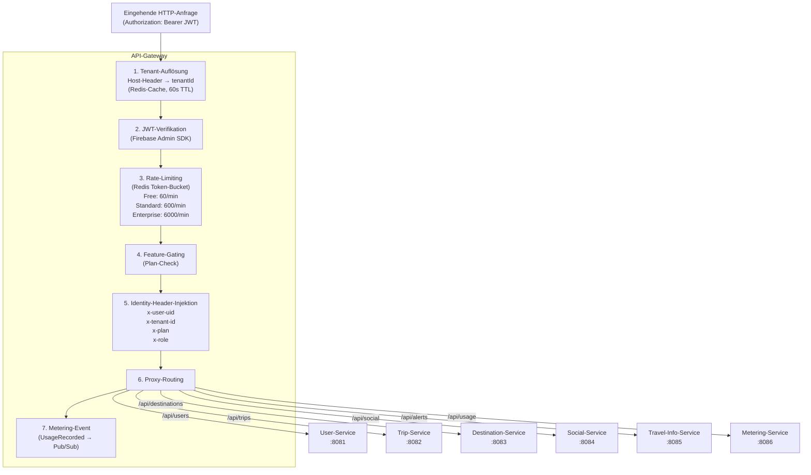

---

## 6. Datenbankarchitektur

### Datenbankschema pro Service

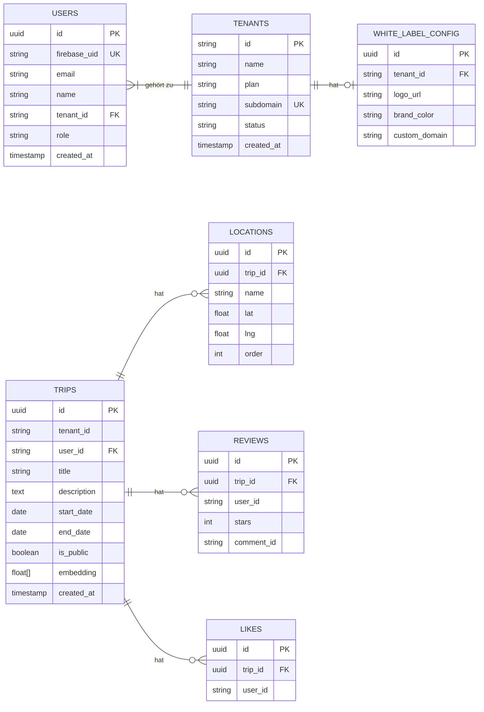

### Multi-Tenant-Datenbankrouting

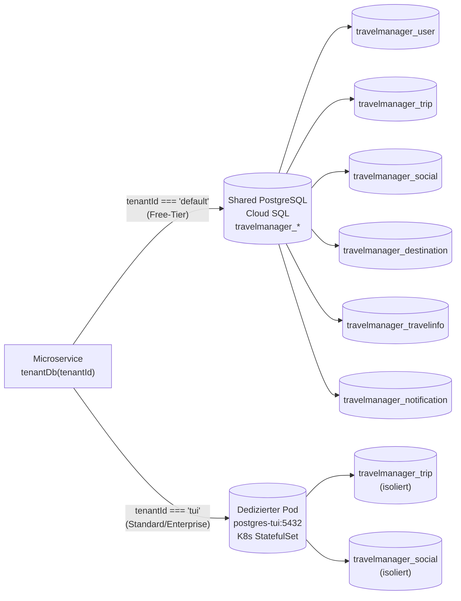

---

## 7. Multi-Tenancy-Modell

Das Herzstück der Plattform ist ein **hybrides Multi-Tenancy-Modell**: Free-Tier-Tenants teilen sich Ressourcen, während Standard- und Enterprise-Kunden dedizierte Datenbankpods erhalten.

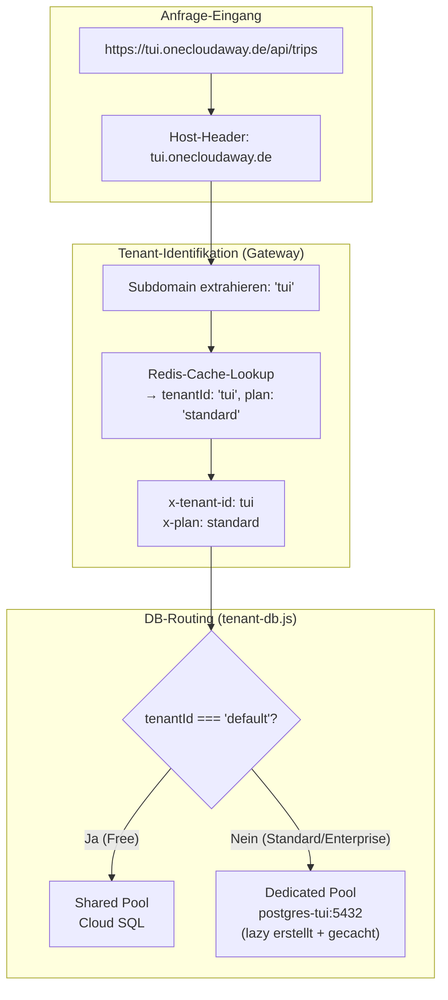

### Tenant-Provisionierung (Self-Serve)

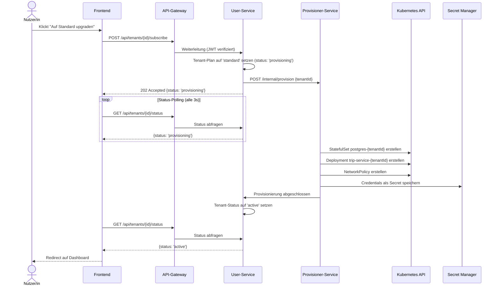

---

## 8. Asynchrone Ereignisverarbeitung

TravelManager nutzt **Google Cloud Pub/Sub** als Event-Backbone für alle nicht zeitkritischen Operationen.

### Event-Flow-Diagramm

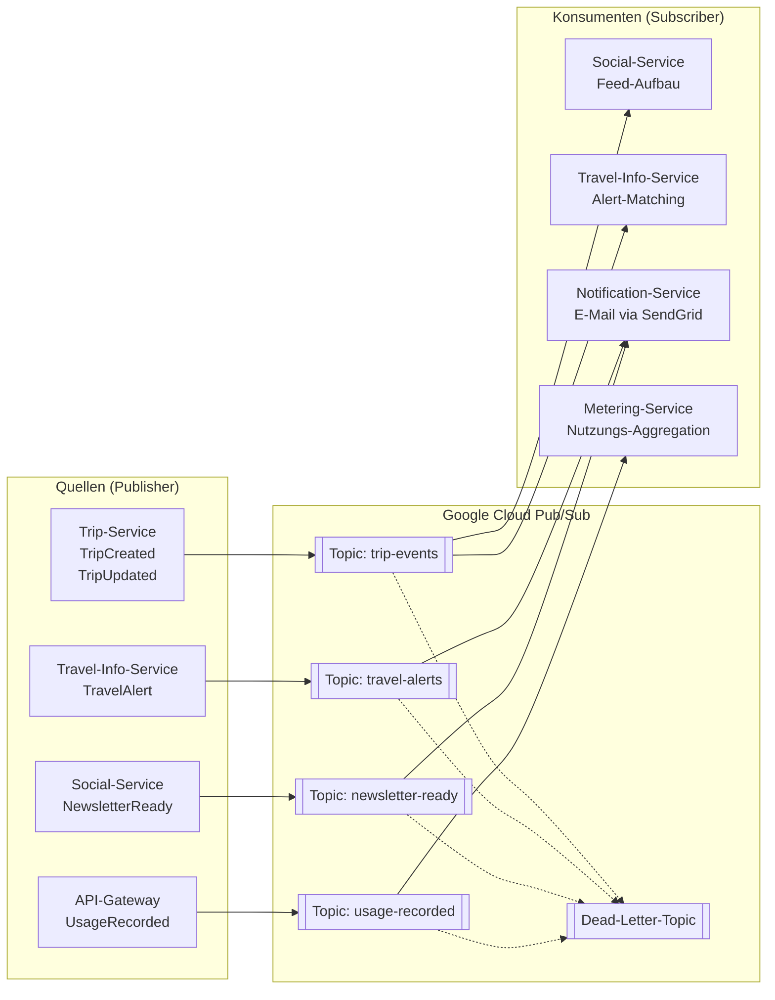

### Sequenzdiagramm: Trip-Erstellung bis E-Mail-Warnung

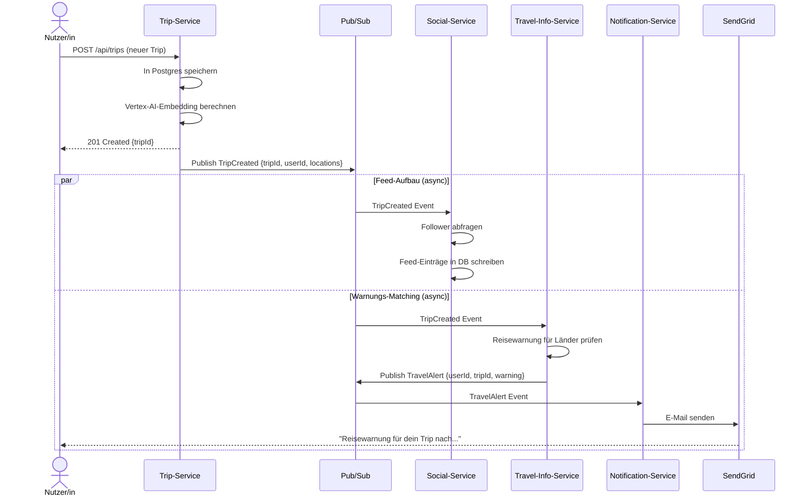

### Metering-Pipeline

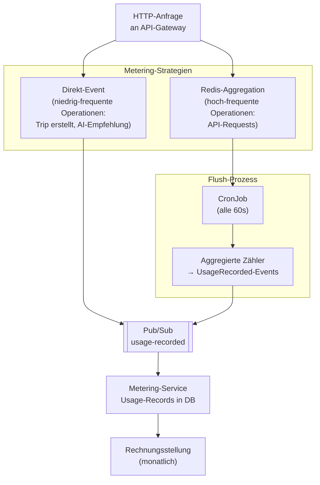

---

## 9. Anfrage-Lebenszyklus

### Vollständiger Request-Flow (authentifiziert)

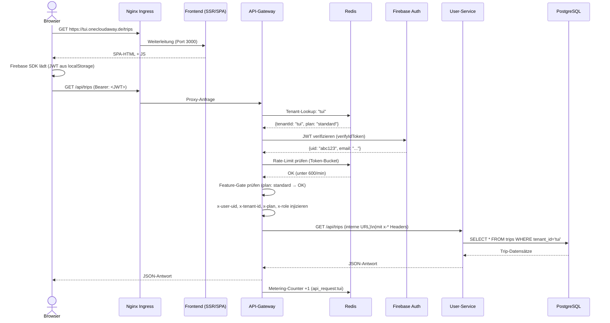

---

## 10. Deployment & Infrastruktur

### Kubernetes-Architektur (GKE Autopilot)

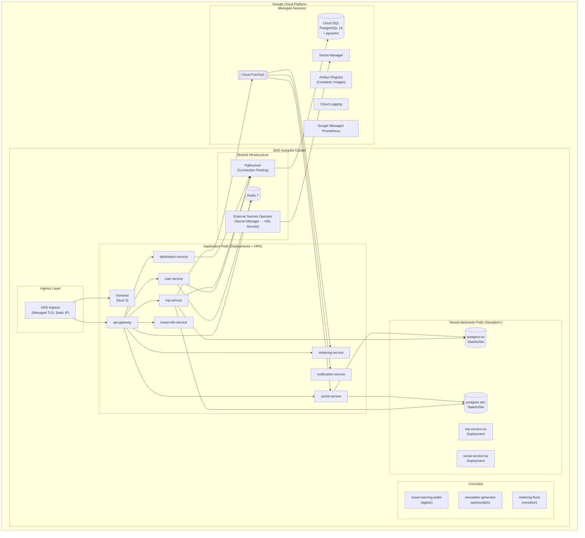

### CI/CD-Pipeline

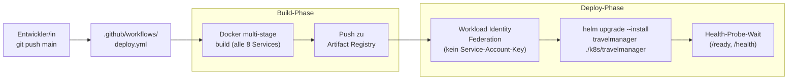

### Terraform-Infrastruktur

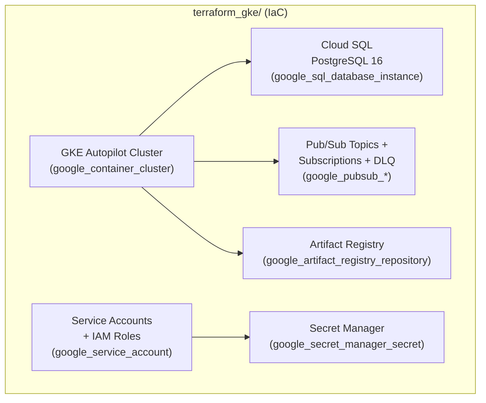

---

## 11. Authentifizierung & Autorisierung

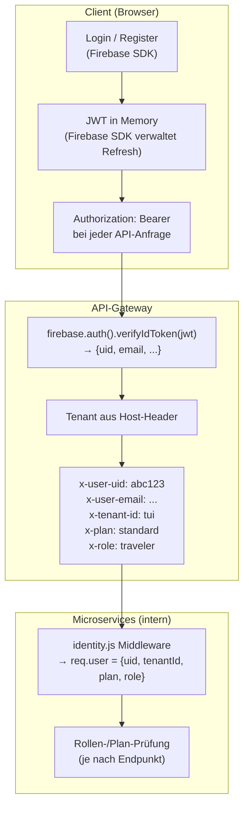

### Rollen & Pläne

| Rolle | Beschreibung | Zugriffsrechte |
|---|---|---|
| `traveler` | Standard-Nutzer/in | Eigene Trips, Community, Feed |
| `destinationMgr` | B2B-Partner | + B2B-Analytics-Endpunkte (Enterprise) |
| `operator` | Plattform-Admin | Admin-Konsole (admin.onecloudaway.de) |

| Plan | Rate-Limit | Features |
|---|---|---|
| `free` | 60 req/min | Basis-Trip-Planung |
| `standard` | 600 req/min | + Personalisierter Feed, Newsletter, White-Label |
| `enterprise` | 6.000 req/min | + B2B-Daten, Premium-Support |

---

## 12. Observability & Metering

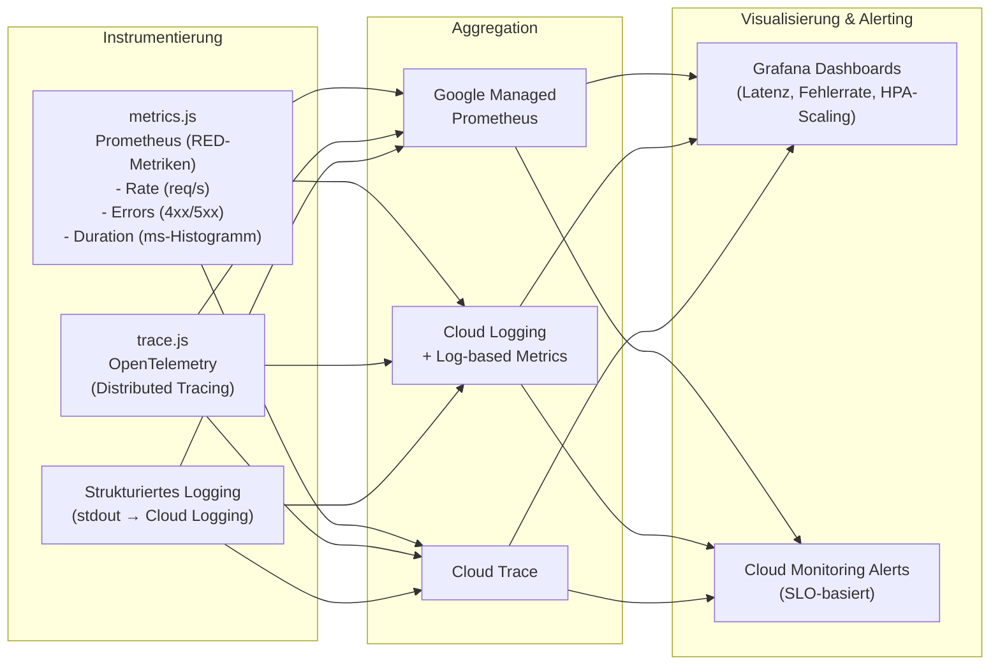

### Billing-Dimensionen

| Dimension | Wann erfasst | Methode |
|---|---|---|
| `api_request` | Jede Gateway-Anfrage | Redis-Aggregation + Cron-Flush |
| `trip_created` | `POST /api/trips` | Direktes Pub/Sub-Event |
| `ai_recommendation` | Embedding-API-Aufruf | Direktes Pub/Sub-Event |
| `active_seat` | Täglicher Snapshot | CronJob |
| `newsletter_sent` | Newsletter-Versand | Direktes Pub/Sub-Event |

---

## 13. Lokale Entwicklungsumgebung

```mermaid
graph TB
    subgraph "docker-compose.dev.yml"
        NGINX_DEV["nginx\n(Port 80)\n/api → gateway:4000\n/ → frontend:3000"]
        FE_DEV["frontend\n(Port 3000)\nNuxt dev server"]
        GW_DEV["api-gateway\n(Port 4000)\nGATEWAY_SKIP_AUTH=1\nx-debug-uid Header"]
        US_DEV["user-service\n(Port 8081)"]
        TS_DEV["trip-service\n(Port 8082)"]
        DS_DEV["destination-service\n(Port 8083)"]
        SS_DEV["social-service\n(Port 8084)"]
        TIS_DEV["travel-info-service\n(Port 8085)"]
        PG_DEV[("PostgreSQL\n(Port 5432)\n+ pgvector"]
        PGB_DEV["PgBouncer\n(Port 5433)"]
        RD_DEV[("Redis\n(Port 6379)"]
    end

    NGINX_DEV --> FE_DEV & GW_DEV
    GW_DEV --> US_DEV & TS_DEV & DS_DEV & SS_DEV & TIS_DEV
    US_DEV & TS_DEV & DS_DEV & SS_DEV --> PGB_DEV --> PG_DEV
    GW_DEV --> RD_DEV
```

**Besonderheiten der lokalen Umgebung:**
- `GATEWAY_SKIP_AUTH=1` — JWT-Verifikation deaktiviert; Identität über `x-debug-uid`-Header setzbar
- `PUBSUB_DISABLED=1` — Pub/Sub-Events werden geloggt statt gesendet; Tasks manuell via `/api/tasks/*` triggerbar
- Gleiche `Dockerfile.service`-Images wie in Produktion → maximale Parität

---

## Verzeichnisstruktur (Überblick)

```
CloudApplicationDevelopment/
├── app/                        # Nuxt 3 SPA (Frontend)
│   ├── components/             # Vue-Komponenten
│   ├── composables/            # useAuth, useApiFetch, usePlan, ...
│   ├── pages/                  # Routen (trips, feed, community, b2b, ...)
│   ├── middleware/             # Route-Guards
│   └── plugins/                # WhiteLabel, Firebase-Client
├── services/
│   ├── api-gateway/            # Zentrales Gateway
│   ├── user-service/           # Profile & Tenants
│   ├── trip-service/           # Trip-Kernlogik
│   ├── destination-service/    # Destinations & B2B
│   ├── social-service/         # Feed & Newsletter
│   ├── travel-info-service/    # Warnungen & Wetter
│   ├── notification-service/   # E-Mail-Versand
│   ├── metering-service/       # Nutzungs-Billing
│   └── provisioner-service/    # Tenant-Provisionierung
├── packages/shared/            # Geteilte Module (npm-Workspace)
│   ├── db.js                   # Postgres-Pool-Factory
│   ├── tenant-db.js            # Multi-Tenant-DB-Routing
│   ├── cache.js                # Redis Read-Through
│   ├── pubsub.js               # Pub/Sub-Helfer
│   ├── tiers.js                # Plan-Definitionen (Source of Truth)
│   └── metering.js             # Usage-Recording
├── k8s/travelmanager/          # Helm-Chart
├── terraform_gke/              # IaC (GKE, Cloud SQL, Pub/Sub, ...)
├── nginx/                      # Reverse-Proxy-Konfigurationen
├── docs/                       # Weiterführende Dokumentation
│   ├── SOFTWARE_ARCHITECTURE.md
│   ├── METERING_AND_MONITORING.md
│   ├── SERVICE_MESH.md
│   └── architecture/           # C4-Diagramme (LikeC4)
├── tests/
│   ├── load/                   # Locust-Lasttests
│   └── unit/                   # Unit-Tests (Vitest)
├── docker-compose.dev.yml      # Lokaler Stack
└── .github/workflows/          # CI/CD (GitHub Actions)
```

---

*Generiert am 26.06.2026 · TravelManager v1.0 · HTWG Konstanz — Cloud Application Development*
